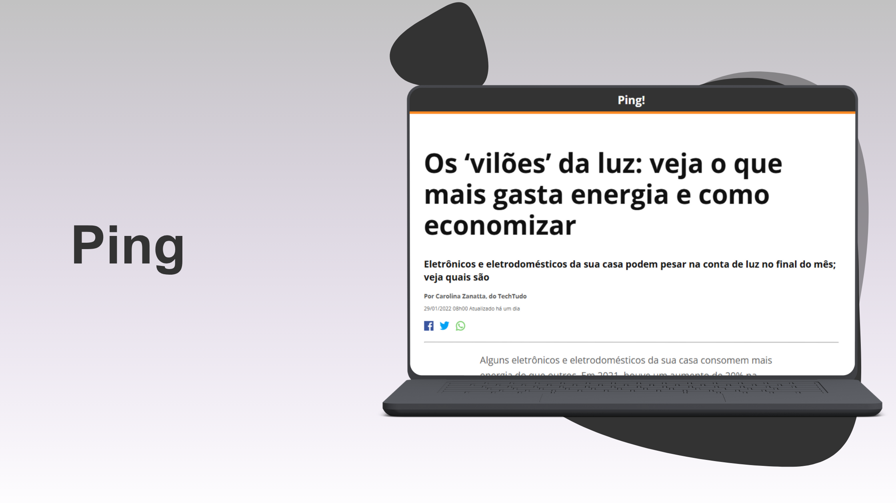

# 📰 Projeto UI – Página de Notícia "Os vilões da luz"

Interface de uma página de notícia inspirada em portais jornalísticos como o TechTudo, com layout limpo, informativo e responsivo. O conteúdo aborda os eletrodomésticos que mais consomem energia e como economizar na conta de luz.

## 🔗 Acesse o projeto

- 💻 [Visualizar no GitHub Pages]([https://seuusuario.github.io/nome-do-projeto/](https://thamiressarges.github.io/pagina-de-conteudo))

---

## 🧰 Tecnologias utilizadas

- HTML5
- CSS3
- Google Fonts (Open Sans)
- Estrutura semântica e responsiva

---

## ✍️ Sobre o projeto

Este projeto foi desenvolvido como parte do meu portfólio pessoal para praticar HTML e CSS na criação de páginas informativas e bem estruturadas. A interface foi inspirada em layouts editoriais de notícias, buscando priorizar:

- Clareza visual e leitura fluida;
- Tipografia e espaçamento bem definidos;
- Elementos reutilizáveis (botões, blocos de texto e imagens com legendas);
- Responsividade para diferentes tamanhos de tela.

---

## 🧠 Aprendizados

- Uso semântico de HTML5
- Criação de layout com `max-width`, `padding`, `line-height` e `flexbox`
- Integração de fontes externas com o Google Fonts
- Estilização de elementos interativos (links, ícones de redes sociais, CTAs)

---

## 📌 Créditos

- Texto adaptado de matéria do [TechTudo](https://www.techtudo.com.br/)
- Imagens utilizadas com fins ilustrativos e educacionais
- Projeto desenvolvido como estudo pessoal e não possui fins comerciais

---

## 🚀 Autor

Desenvolvido por **Thamires Sarges**  
📫 [linkedin.com/in/thamiressarges](https://www.linkedin.com/in/thamiressarges)  

---

